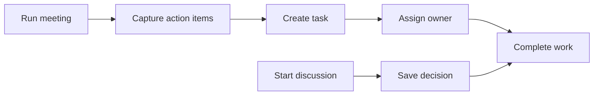
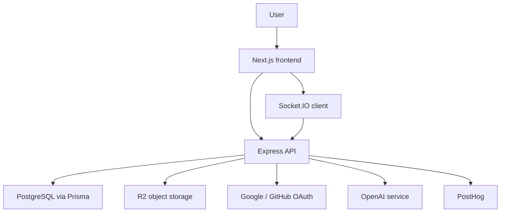

<div align="center">

# TeamPoint

### Stop managing work. Start finishing it.

TeamPoint is a focused workspace for small startup and dev teams to manage tasks,
project discussions, decisions, meetings, and action items without the clutter of
heavy project management tools.

[](#project-status)
[](#tech-stack)
[](#tech-stack)
[](#tech-stack)
[](#tech-stack)

</div>

---

## What is TeamPoint?

TeamPoint is a proof-of-concept moving into beta for teams that need structure,
but do not want to spend half their day managing the tool.

It connects the three places where small teams usually lose momentum:

| Work area | TeamPoint helps you |
| --- | --- |
| Tasks | Create, assign, prioritize, and complete work without overthinking the process. |
| Discussions | Keep project conversations close to the work and turn outcomes into decisions. |
| Meetings | Capture action items and move them into tasks before they disappear. |

> TeamPoint is not trying to become the biggest workspace. It is trying to become
> the cleanest path from conversation to finished work.

## Why TeamPoint?

Small teams often try to force their workflow into tools built for bigger,
heavier organizations. TeamPoint takes the opposite approach.

| Typical tools | TeamPoint |
| --- | --- |
| Feature-heavy | Focused workflow |
| Complex setup | Start in minutes |
| Endless options | Clear next step |
| Work scattered across apps | Tasks, discussions, and meetings connected |

## Who it is for

TeamPoint is designed for:

- Small startup teams that want to move faster without process overhead.
- Dev teams that need tasks, discussions, meetings, and ownership in one place.
- Founders and builders who want clarity without setting up a full enterprise tool.
- Early teams that want a lightweight product workflow before adopting heavier systems.

It is probably not the right fit if you need enterprise-grade customization,
deep reporting, or a fully mature Jira-style workflow engine today.

## Product flow



## Features

| Area | What is included |
| --- | --- |
| Workspaces | Create workspaces, invite members, and manage team access. |
| Projects | Organize work into projects with overview, members, tasks, documents, discussions, and meetings. |
| Tasks | Kanban/list-style task management with priorities, due dates, status, assignees, and ownership. |
| Discussions | Project-level discussions and messages that keep context close to the work. |
| Meetings | Schedule, track, complete, and turn meetings into action items. |
| Documents | Upload and link project documents and related resources. |
| Members | Invite teammates, manage roles, and track workspace/project membership. |
| Integrations | Google/GitHub integration foundations are present in the backend. |
| Feedback | In-app feedback and bug reporting support. |
| AI | AI-powered workflow helpers are planned and partially represented in the backend foundations. |

## Tech stack

| Layer | Tools |
| --- | --- |
| Frontend | Next.js 16, React 19, TypeScript, Tailwind CSS 4, shadcn/ui, TanStack Query, Zustand |
| Backend | Node.js, Express 5, TypeScript, Prisma 7, PostgreSQL, Socket.IO |
| Auth | Google OAuth, GitHub OAuth, JWT access/refresh token flow |
| Storage | Cloudflare R2/S3-compatible storage support |
| Observability | PostHog, Winston logging, Discord alert webhook |
| Testing | Jest, Supertest |
| Tooling | ESLint, Prettier, Husky, lint-staged |

## Architecture



## Repository structure

```text
TeamPoint/
|-- backend/                 # Express API, Prisma, modules, services, tests
|   |-- prisma/              # Schema, migrations, seed data
|   |-- src/
|   |   |-- modules/         # Auth, workspace, project, tasks, meetings, etc.
|   |   |-- middlewares/     # Auth, validation, rate limits, logging
|   |   |-- services/        # Socket, OpenAI, Discord
|   |   `-- utils/           # Shared backend helpers
|   `-- tests/               # Unit/integration test setup
|-- frontend/                # Next.js app
|   |-- app/                 # App Router pages and layouts
|   |-- components/          # UI, landing, auth, dashboard, project components
|   |-- features/            # API hooks, schemas, feature types
|   |-- hooks/               # Shared React hooks
|   |-- lib/                 # API client, socket, query client, utilities
|   `-- store/               # Zustand stores
`-- design.md                # Design system notes and UI direction
```

## Getting started

### Prerequisites

- Node.js 20+
- npm
- PostgreSQL database
- OAuth credentials for Google/GitHub if testing real login flows
- R2/S3-compatible storage credentials if testing uploads

### 1. Clone the repository

```bash
git clone <repository-url>
cd TeamPoint
```

### 2. Install dependencies

```bash
cd backend
npm install

cd ../frontend
npm install
```

### 3. Configure environment variables

Create environment files for both apps.

```bash
backend/.env
frontend/.env.local
```

Frontend variables:

```env
NEXT_PUBLIC_API_URL=http://localhost:5000/api/v1
NEXT_PUBLIC_SOCKET_URL=http://localhost:5000
NEXT_PUBLIC_POSTHOG_KEY=
NEXT_PUBLIC_POSTHOG_HOST=
```

Backend variables include database, auth, OAuth, email, storage, analytics, and
AI credentials. The backend validates required variables in
`backend/src/config/env.ts`.

<details>
<summary>Backend environment checklist</summary>

```env
NODE_ENV=development
PORT=5000
DATABASE_URL=
CLIENT_URL=http://localhost:3000
CORS_ORIGIN=http://localhost:3000

DEV_AUTH_SECRET=
ACCESS_TOKEN_SECRET=
REFRESH_TOKEN_SECRET=
ACCESS_TOKEN_EXPIRY=
REFRESH_TOKEN_EXPIRY=

GOOGLE_LOGIN_CLIENT_ID=
GOOGLE_LOGIN_CLIENT_SECRET=
GOOGLE_LOGIN_CALLBACK_URL=
GITHUB_LOGIN_CLIENT_ID=
GITHUB_LOGIN_CLIENT_SECRET=
GITHUB_LOGIN_CALLBACK_URL=

GOOGLE_INTEGRATION_CLIENT_ID=
GOOGLE_INTEGRATION_CLIENT_SECRET=
GOOGLE_INTEGRATION_CALLBACK_URL=

EMAIL_HOST=
EMAIL_PORT=
BREVO_SMTP_USER=
BREVO_SMTP_PASS=
EMAIL_FROM=

STORAGE_PROVIDER=
R2_ACCESS_KEY_ID=
R2_SECRET_ACCESS_KEY=
R2_ENDPOINT=
R2_BUCKET_NAME=
R2_AVATAR_BUCKET_NAME=
R2_TOKEN_VALUE=
R2_AVATARS_PUBLIC_BASE_URL=

GITHUB_PAT=
GITHUB_OWNER=
GITHUB_REPO=

OPENAI_API_KEY=
DISCORD_ALERT_WEBHOOK_URL=
POSTHOG_PROJECT_TOKEN=

ENABLE_RATE_LIMIT=true
GLOBAL_RATE_LIMIT=100
AUTH_RATE_LIMIT=5
UPLOAD_RATE_LIMIT=30
API_RATE_LIMIT=60
INTEGRATION_RATE_LIMIT=20
REFRESH_TOKEN_RATE_LIMIT=10
```

</details>

### 4. Prepare the database

```bash
cd backend
npx prisma migrate dev
npm run seed
```

### 5. Run the apps

Backend:

```bash
cd backend
npm run dev
```

Frontend:

```bash
cd frontend
npm run dev
```

Open the frontend at:

```text
http://localhost:3000
```

## Available scripts

### Frontend

| Command | Purpose |
| --- | --- |
| `npm run dev` | Start the Next.js dev server. |
| `npm run build` | Build the frontend for production. |
| `npm run start` | Start the production frontend server. |
| `npm run lint` | Run ESLint. |
| `npm run format:check` | Check formatting with Prettier. |
| `npm run format:fix` | Format files with Prettier. |

### Backend

| Command | Purpose |
| --- | --- |
| `npm run dev` | Start the API with `tsx watch`. |
| `npm run dist` | Compile TypeScript. |
| `npm run start` | Start the compiled production server. |
| `npm run seed` | Seed development data. |
| `npm run test` | Run the Jest test suite. |
| `npm run test:unit` | Run unit tests. |
| `npm run test:integration` | Run integration tests. |
| `npm run lint` | Run ESLint. |
| `npm run format:check` | Check formatting with Prettier. |

## Project status

TeamPoint is currently in beta early access.

Current focus:

- Polish the landing page and onboarding flow.
- Make the task, discussion, and meeting loop feel natural.
- Improve workspace/project setup for first-time teams.
- Explore AI features for meeting notes, planning, and action item creation.

## Roadmap

- AI-assisted meeting summaries and task creation.
- Better imports/migration from existing tools.
- Deeper calendar and GitHub integrations.
- More dashboard and workload insights.
- Production-ready documentation and deployment guide.

## Contributing

This is currently a personal portfolio/product project. If you are exploring the
codebase, start with the feature folders and keep changes scoped to the module
you are working on.

Recommended workflow:

1. Create a feature branch.
2. Run lint/tests for the area you changed.
3. Keep UI changes consistent with the existing Tailwind/shadcn patterns.
4. Open a pull request with screenshots for frontend changes.

## License

This project is currently unlicensed and marked as `UNLICENSED` in the backend
package metadata. Do not reuse or redistribute without permission.

---

<div align="center">

Built for small teams that want less tool management and more finished work.

</div>
