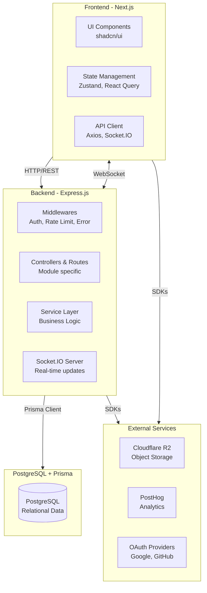

# Architecture Overview

This document outlines the architectural design and key technical decisions for TeamPoint.

## System Overview

TeamPoint is built as a monorepo using **Turborepo** (`turbo.json`).
The repository contains two main applications:
- **`apps/backend`**: Express.js + TypeScript REST API.
- **`apps/frontend`**: Next.js (App Router) + TypeScript frontend application.

The monorepo structure allows for unified dependency management, centralized linting, formatting, and build caching.

## Architecture Diagram

## Backend Architecture

The backend is built with **Node.js, Express 5, and TypeScript** using ESM (`"type": "module"`). 
It follows a **feature-module pattern** rather than a traditional MVC structure.

Each module handles a specific domain (e.g., `workspace`, `project`, `task`) and consists of:
- **`route.ts`**: Defines the HTTP endpoints and middleware bindings.
- **`controller.ts`**: Extracts data from requests and passes it to services, then returns the HTTP response.
- **`service.ts`**: Contains the core business logic and interacts with the database.
- **`schema.ts`**: Defines Zod validation schemas for requests.
- **`permission.ts`** (Optional): Defines role-based access control rules.

### Middleware Pipeline
Requests pass through a robust middleware pipeline:
1. CORS & Helmet (Security headers)
2. Rate Limiting (Prevent abuse, with granular limits based on endpoint)
3. Authentication (Passport.js / JWT)
4. Validation (Zod schemas)
5. Authorization (Role-based access checks)
6. Route Handler (Controller)
7. Global Error Handler

## Frontend Architecture

The frontend is a **Next.js 16** application using the **App Router**, **React 19**, and **Tailwind CSS 4**.

Key concepts:
- **Feature-Based Organization**: Code is grouped by domain (e.g., `features/workspace`, `features/tasks`) rather than by technical concern.
- **Component Architecture**: Built using **shadcn/ui** and Radix UI primitives.
- **State Management**: 
  - **React Query (TanStack Query)**: Handles server state, caching, background updates, and optimistic UI.
  - **Zustand**: Handles complex client-side state.
- **Real-time**: Socket.IO client integrates with React contexts to provide live updates for tasks, meetings, and discussions.

## Database Architecture

TeamPoint uses **PostgreSQL** via the **Prisma ORM**.

Key models and relations:
- `User`: Central entity for authentication.
- `Workspace`: The root isolation level. A user can belong to multiple workspaces.
- `Project`: Scoped to a Workspace. 
- `Task`, `Meeting`, `Discussion`: Scoped to a Project (or Workspace/User depending on type).

**Tenant Isolation**: Data is separated logically via the `workspaceId` relationship. Queries typically enforce the workspace context to prevent cross-tenant data leakage.

## Authentication Flow

1. **OAuth/Login**: Users authenticate via Google/GitHub OAuth or email/password.
2. **Tokens**: Backend generates a short-lived Access Token (JWT, 30m) and a long-lived Refresh Token (7d).
3. **Cookies**: Both tokens are sent as `httpOnly` cookies for security against XSS.
4. **Token Rotation**: The frontend automatically requests a new access token using the refresh token when the access token expires.

## Authorization Model

TeamPoint uses a hierarchical Role-Based Access Control (RBAC) system:
- **Workspace Roles**: `OWNER`, `ADMIN`, `MEMBER`. Defines global capabilities within a workspace.
- **Project Roles**: Users can have specific roles within a project, separate from their workspace role.
- **Permission Middleware**: Routes are protected by middleware that checks both the user's role and their relation to the requested resource.

## External Services

- **Cloudflare R2 / AWS S3**: Used for object storage (avatars, document attachments).
- **PostHog**: Product analytics and feature flagging.
- **Google/GitHub OAuth**: Authentication providers.
- **Brevo/Nodemailer**: Transactional email delivery.

## Shared Types Package

Types and interfaces that need to be shared between frontend and backend can be organized in a centralized types package (if applicable) or exported appropriately to maintain type sync across boundaries.

## Key Design Decisions

- **ESM Modules**: The backend is fully ESM, meaning `.js` extensions are used in imports.
- **Type Safety**: End-to-end type safety using TypeScript and Prisma generated types.
- **Prisma Client Generation**: Prisma client is generated into a custom output directory to support the Docker build process and monorepo structure.
